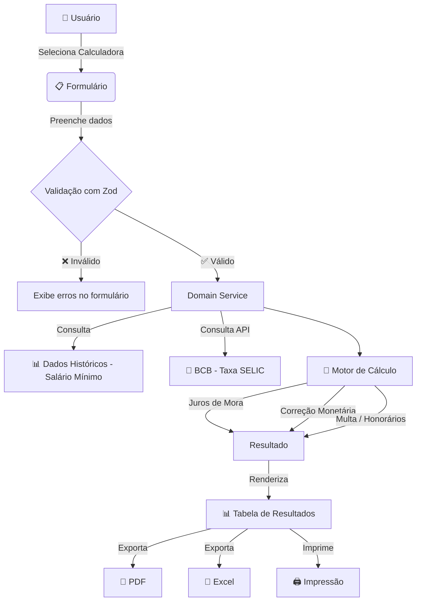

# JUSCALC — Calculadoras Judiciais Online


[](https://app.netlify.com/projects/cpa-calculopensaoalimenticia/deploys)
[](https://opensource.org/licenses/MIT)
[](https://pensao-calculadora-online.lovable.app/)

<p>&nbsp;</p>

<div align="center">
  
</div>

<p>&nbsp;</p>

### **Índice**

1. [📝 Descrição do Projeto](#-descrição-do-projeto)
2. [⚙️ Arquitetura e Tecnologias](#️-arquitetura-e-tecnologias)
3. [📁 Estrutura do Projeto](#-estrutura-do-projeto)
4. [🔄 Fluxo de Funcionamento](#-fluxo-de-funcionamento)
5. [🚀 Funcionalidades e Demonstração](#-funcionalidades-e-demonstração)
6. [📐 Cálculos Implementados](#-cálculos-implementados)
7. [💻 Como Executar](#-como-executar-o-projeto)
8. [🔒 Conformidade Legal (LGPD)](#-conformidade-legal-lgpd)
9. [👥 Equipe](#-equipe-do-projeto)
10. [✅ Conclusão](#-conclusão)
11. [📸 Prévia](#-prévia-do-projeto)

<p>&nbsp;</p>

## 📝 **Descrição do Projeto**

O **JUSCALC** é uma plataforma web gratuita de cálculos judiciais, projetada para simplificar e automatizar processos que tradicionalmente demandam tempo e expertise técnica de advogados, contadores e profissionais do Direito. A ferramenta oferece calculadoras especializadas para diferentes áreas jurídicas brasileiras, incluindo Pensão Alimentícia, Cível, Fazenda Pública, ITD/Sucessões e Trabalhista.

Em um cenário onde cálculos judiciais retroativos envolvem múltiplas variáveis — como índices de correção monetária, taxas SELIC, salários mínimos históricos, juros de mora e multas processuais — o JUSCALC atua como uma ferramenta que aplica automaticamente todos esses fatores de acordo com a legislação vigente, eliminando erros manuais e reduzindo drasticamente o tempo de elaboração de cálculos.

A aplicação foi desenvolvida com foco em **precisão**, **usabilidade** e **acessibilidade**, garantindo que qualquer profissional possa obter estimativas confiáveis em poucos cliques, com exportação para PDF e Excel para uso em petições e documentos judiciais.

### **Principais Diferenciais**

* 🚀 **Performance:** Aplicação 100% client-side, sem dependência de servidores — cálculos instantâneos no navegador.
* 📊 **Precisão:** Base de dados integrada com salários mínimos históricos e índices econômicos oficiais (SELIC via API do Banco Central do Brasil).
* 🖨️ **Exportação Profissional:** Geração de relatórios em PDF e planilhas Excel prontos para uso em processos judiciais.
* 📱 **Responsividade:** Interface totalmente adaptável para desktop, tablet e dispositivos móveis.
* ♿ **Acessibilidade:** Página dedicada de acessibilidade com conformidade a padrões web (WCAG).
* 🔒 **Privacidade:** Nenhum dado pessoal é coletado ou armazenado — todos os cálculos são processados localmente.

<p>&nbsp;</p>

## ⚙️ **Arquitetura e Tecnologias**

O projeto segue uma arquitetura **Clean Architecture** adaptada para o frontend, com clara separação de responsabilidades entre camadas de domínio, infraestrutura e interface.

#### **Tecnologias Utilizadas**

| Camada | Tecnologia | Função |
| :--- | :--- | :--- |
| **Linguagem** | TypeScript 5 | Tipagem estática e segurança em tempo de desenvolvimento |
| **Framework** | React 18 | Construção de interfaces reativas e componentizadas |
| **Build Tool** | Vite 7 | Build extremamente rápido com HMR (Hot Module Replacement) |
| **Estilização** | Tailwind CSS 3 | Framework CSS utilitário com design system personalizado |
| **Componentes UI** | shadcn/ui + Radix UI | Componentes acessíveis, customizáveis e com design moderno |
| **Formulários** | React Hook Form + Zod | Validação performática de formulários com schemas tipados |
| **Datas** | date-fns | Manipulação e formatação de datas de forma imutável |
| **PDF** | jsPDF + @react-pdf/renderer | Geração de relatórios em PDF |
| **Planilhas** | ExcelJS | Exportação de dados para formato .xlsx |
| **API Econômica** | BCB (Banco Central) | Consulta de índices SELIC e correção monetária |
| **State** | TanStack React Query | Gerenciamento de cache e estado assíncrono |
| **Roteamento** | React Router DOM 6 | Navegação SPA com rotas protegidas |
| **Analytics** | Google Analytics (GA4) | Métricas de uso com consentimento do usuário (LGPD) |
| **Deploy** | Netlify | Deploy contínuo com integração ao repositório |

<p>&nbsp;</p>

## 📁 **Estrutura do Projeto**

```bash
juscalc/
│
├── public/                          # Ativos estáticos
│   ├── img/                         # Logos e imagens
│   ├── favicon.ico
│   └── robots.txt
│
├── src/
│   ├── app/                         # Configuração principal (App.tsx, rotas)
│   │
│   ├── domain/                      # 🧠 Camada de Domínio (regras de negócio)
│   │   ├── calculators/             # Lógica de cada calculadora
│   │   │   ├── alimony/             #   └── Pensão Alimentícia
│   │   │   ├── civil/               #   └── Cível
│   │   │   ├── fazenda/             #   └── Fazenda Pública
│   │   │   ├── itd/                 #   └── ITD / Sucessões
│   │   │   └── labor/               #   └── Trabalhista (salário, horas extras, etc.)
│   │   ├── models/                  # Interfaces e tipos TypeScript
│   │   └── services/                # Serviços de cálculo, utilitários financeiros
│   │       └── data/                #   └── Dados históricos (salário mínimo)
│   │
│   ├── infrastructure/              # 🔌 Camada de Infraestrutura
│   │   ├── api/                     # Integração com APIs externas (BCB)
│   │   └── export/                  # Exportação PDF e Excel
│   │
│   ├── ui/                          # 🎨 Camada de Apresentação
│   │   ├── components/
│   │   │   ├── shared/              # Componentes globais (Header, Footer, Sidebar)
│   │   │   └── ui/                  # Design System (shadcn/ui customizado)
│   │   ├── hooks/                   # Custom hooks (useIsMobile, useToast)
│   │   ├── layouts/                 # Layouts (MainLayout, PrintLayout)
│   │   └── pages/                   # Páginas da aplicação
│   │       └── components/          # Componentes específicos de cada página
│   │           ├── alimony/         #   └── Formulários e tabelas de Pensão
│   │           ├── calculators/     #   └── Formulários das demais calculadoras
│   │           └── instructions/    #   └── Componentes de instrução
│   │
│   └── utils/                       # Utilitários genéricos
│       ├── date/                    # Manipulação de datas
│       └── formatters/              # Formatação de moeda
│
├── index.html                       # Entry point HTML
├── vite.config.ts                   # Configuração do Vite
├── tailwind.config.ts               # Design tokens e tema
├── tsconfig.json                    # Configuração TypeScript
└── package.json                     # Dependências e scripts
```

<p>&nbsp;</p>

## 🔄 **Fluxo de Funcionamento**



### **Detalhamento do Fluxo**

1. **Entrada:** O usuário seleciona a calculadora desejada e preenche o formulário com os dados do caso (período, valores, percentuais, etc.).
2. **Validação:** Os dados são validados em tempo real via schemas Zod, impedindo envios inconsistentes.
3. **Processamento:** O motor de cálculo (Domain Services) aplica as regras de negócio específicas de cada área jurídica.
4. **Dados Externos:** Consulta a base interna de salários mínimos e, quando necessário, a API do Banco Central do Brasil para índices SELIC atualizados.
5. **Resultado:** Os valores são apresentados em tabela detalhada mês a mês com totalizadores.
6. **Exportação:** O usuário pode exportar os resultados em PDF, Excel ou imprimir diretamente.

<p>&nbsp;</p>

## 🚀 **Funcionalidades e Demonstração**

### **1. 📌 Calculadora de Pensão Alimentícia**
Calcula débitos retroativos de pensão alimentícia com base no salário mínimo ou remuneração do alimentante. Inclui:
- Cálculo com ou sem vínculo empregatício
- Inclusão de 13º salário proporcional
- Juros de mora (1% a.m. — Art. 406 CC + Art. 161 §1º CTN)
- Correção monetária por índices oficiais (Lei 6.899/81)
- Multa de 10% e honorários de 10% (Art. 523 §1º CPC)
- Escolha do método de cálculo de juros: sobre o principal ou sobre o valor corrigido

### **2. ⚖️ Calculadora Cível**
Atualização de valores para ações cíveis em geral:
- Correção monetária com base na taxa SELIC (via API do BCB)
- Juros de mora configuráveis
- Cálculo com ano comercial (360 dias) ou civil (365 dias)

### **3. 🏛️ Calculadora Fazenda Pública**
Cálculos específicos para ações contra a Fazenda Pública:
- Aplicação da taxa SELIC como índice único de correção e juros
- Conformidade com a legislação de precatórios e RPVs
- Suporte a períodos longos de atualização

### **4. 📜 Calculadora ITD / Sucessões**
Cálculo do Imposto sobre Transmissão por Doação (ITD):
- Atualização de valores de herança e doação
- Aplicação de alíquotas conforme legislação estadual
- Correção monetária e juros de mora

### **5. 👷 Calculadora Trabalhista**
Módulo completo para cálculos trabalhistas:
- **Verbas Rescisórias:** Cálculo de saldo de salário, férias, 13º, FGTS e multa rescisória
- **Horas Extras:** Cálculo com adicional de 50% ou 100%, DSR e reflexos
- **Adicionais:** Insalubridade (10%, 20%, 40%) e periculosidade (30%)
- **Seguro-Desemprego:** Simulação de parcelas com base na tabela vigente

### **6. 🛡️ Páginas Institucionais**
- Termos de Uso
- Política de Privacidade (conformidade LGPD)
- Acessibilidade (conformidade WCAG)

<p>&nbsp;</p>

## 📐 **Cálculos Implementados**

### **Base de Dados - Salário Mínimo**
A aplicação mantém uma base de dados interna com os valores históricos do salário mínimo brasileiro, utilizada como referência para cálculos baseados em percentuais do mínimo vigente em cada período.

### **Juros de Mora**
- **Taxa:** 1% ao mês, pro rata die
- **Fundamentação:** Art. 406 do Código Civil (Lei 10.406/2002) c/c Art. 161 §1º do CTN (Lei 5.172/1966)
- **Contagem:** Exclui o dia do vencimento, conta até a data de atualização

### **Correção Monetária**
- **Índice:** SELIC obtida via API do Banco Central do Brasil
- **Fundamentação:** Lei 6.899/81 e jurisprudência do STJ
- **Aplicação:** Fator acumulado desde o mês de vencimento até o mês de atualização

### **Multa Processual**
- **Valor:** 10% sobre o débito
- **Fundamentação:** Art. 523 §1º do CPC (Lei 13.105/2015)
- **Condição:** Aplicável quando selecionada pelo usuário

### **Honorários Advocatícios**
- **Valor:** 10% sobre o débito
- **Fundamentação:** Art. 523 §1º do CPC (Lei 13.105/2015)
- **Condição:** Aplicável quando selecionada pelo usuário

<p>&nbsp;</p>

## 💻 **Como Executar o Projeto**

### **Pré-requisitos**
* **Node.js** 18+ ou **Bun** (recomendado)
* **Git**

### **Execução Local**

```bash
# 1. Clone o repositório
git clone https://github.com/amaro-netto/juscalc.git

# 2. Entre na pasta do projeto
cd juscalc

# 3. Instale as dependências
npm install
# ou com Bun (mais rápido):
bun install

# 4. Execute em modo de desenvolvimento
npm run dev
# ou:
bun dev

# 5. Acesse no navegador
# http://localhost:8080
```

### **Scripts Disponíveis**

| Comando | Descrição |
| :--- | :--- |
| `npm run dev` | Inicia o servidor de desenvolvimento (porta 8080) |
| `npm run build` | Gera build de produção otimizada em `/dist` |
| `npm run build:dev` | Gera build em modo desenvolvimento |
| `npm run preview` | Visualiza o build de produção localmente |
| `npm run lint` | Executa o ESLint para análise estática do código |

### **Variáveis de Ambiente**
A aplicação não requer variáveis de ambiente obrigatórias. Todas as consultas à API do BCB são feitas de forma pública. O Google Analytics (GA4) é configurado diretamente no `index.html` e só é ativado após consentimento do usuário.

<p>&nbsp;</p>

## 🔒 **Conformidade Legal (LGPD)**

O JUSCALC foi desenvolvido em total conformidade com a **Lei Geral de Proteção de Dados (Lei 13.709/2018)**:

| Aspecto | Implementação |
| :--- | :--- |
| **Coleta de dados** | Nenhum dado pessoal é coletado, armazenado ou transmitido |
| **Processamento** | 100% local (client-side) — dados nunca saem do navegador |
| **Cookies** | Banner de consentimento implementado (opt-in) |
| **Analytics** | Google Analytics GA4 carregado apenas após aceite do usuário |
| **Transparência** | Páginas de Política de Privacidade e Termos de Uso acessíveis |

<p>&nbsp;</p>

## 👥 **Equipe do Projeto**

<a href="https://github.com/amaro-netto" title="Amaro Netto">
  
</a>

<p>&nbsp;</p>

## ✅ **Conclusão**

O **JUSCALC** nasceu da necessidade real de advogados e profissionais do Direito de terem acesso a uma ferramenta confiável, gratuita e acessível para cálculos judiciais. Ao longo do desenvolvimento, os maiores desafios foram garantir a **precisão matemática** dos cálculos em conformidade com a legislação brasileira e a integração com dados econômicos oficiais do Banco Central.

O projeto demonstra a aplicação prática de conceitos como **Clean Architecture no frontend**, **design system com tokens semânticos**, **acessibilidade web (WCAG)** e **conformidade com a LGPD**. A arquitetura foi pensada para ser **extensível** — novas calculadoras podem ser adicionadas seguindo o mesmo padrão de domínio já estabelecido.

> [!IMPORTANT]
> **Aviso Legal**: Esta ferramenta foi desenvolvida exclusivamente para **fins informativos**. Ela não substitui a orientação jurídica profissional e não deve ser utilizada como única base para decisões legais. Os cálculos são baseados na legislação vigente e nos dados fornecidos pelo usuário, podendo haver variações de acordo com interpretações judiciais específicas ou particularidades de cada caso. Sempre consulte um profissional do direito.

<p>&nbsp;</p>

## 📸 **Prévia do Projeto**

🔗 **Acesse o JUSCALC:** [https://pensao-calculadora-online.lovable.app](https://pensao-calculadora-online.lovable.app)

 

---

<div align="center">
  <strong>© 2026 JUSCALC</strong> - Desenvolvido por <em>Amaro Netto</em>.
</div>
